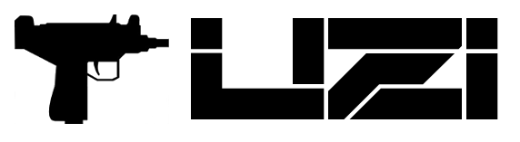

> An Element positioning system inspired by SICP's "Propagation of Constraints".

# Quick Start

``` sh
npm install
python -mSimpleHTTPServer
```

Browse the `/examples` directory.

# Feature Overview

``` html
<div uz-rect id="A"></div>
<div uz-rect id="B"></div>
```

### Constrain properties of an element.

``` sass
#B {

  //  Anchor elements to eachother
  left: A.right;

  // Center in another element.
  center-in: A;

  // Basic expressions can be used.
  right: A.right + B.width / 2;

}

// Classes are supported
.class-name {
  height: B.width / A.height;
}
```

### Interface with JavaScript.

``` js

// assign variables
engine.assign("x", 100);

// add user defined functions
engine.func("fooBar", () => 200);
engine.funcs(Math, "Math");
```

``` sass
#B {

  // using variable
  height: x * A.height;

  // using user defined functions
  width: C.height - Math.min(A.height, fooBar());
  left:  B.right + Math.sin(x) * 100px;
}
```

### Declare rules inline.

``` html
<div uz-rect id="A"></div>
<div uz-style="width: A.height * 3"></div>
```

# Rule Attributes

* `left`
* `right`
* `top`
* `bottom`
* `width`
* `height`
* `center-x`
* `center-y`
* `center-in`
* `relative-to`
* `align-x`
* `align-y`
* `size`
* `watch`

# Element Attributes

* `uz-rect`
* `uz-style`

# Special Rects

* `viewport`
* `body`
* `document`

These can be used like any other rect in the system.

``` sass
#item {
  center-x: viewport.center-x;
  top: 10px;
}
```

Note: user's can create custom rects by extending the `Rect` `class`.

# Setup

The `Engine` `class` is how the user interacts with the system.

``` ts
let engine = new uzi.Engine();

// assign variables and attach functions

engine.initialize(/* options */);
```

By default, the engine will walk the entire DOM and mount Elements which have an 
`uz-rect` or `uz-style` attribute.  This behaviour is configured via an options object passed 
into the `Engine#initialize` method.

``` ts
interface EngineOptions {

  // Find and parse script tags where type="text/uzi"
  findStyleSheets?: boolean;

  // Walk the dom and find elements with `uz-rect` or `uz-style` attributes.
  findElements?: boolean;

  // Use the selectors in the stylesheets to lookup elements in the dom.
  lookupSelectors?: boolean;

  // Provide pre-compiled rules to the env.
  envData?: EnvData;
}
```

Default Engine Options:

``` ts
{
  findStyleSheets: true,
  findElements:    true
}
```

## Manually managing Element life-cycle

Element life-cycles can be manually managed using the `Engine#mount` and `Engine#unmount` methods.

``` ts
// start managing the element.
engine.mount(element);

// stop managing the element.
engine.unmount(element);
```

## Pre-Compiling

> This is still a work in progress.

A cache of all source to compiled rules is kept during runtime. If you export this
data, and initialize uzi with it, the parser doesn't need to be sent
to the client.

**Export:**
``` ts
let envData = engine.getEnv().getExportData();
```

**Import:**
``` ts
let engine = new uzi.Engine({ envData });
```


# Angular Integration

Angular integration lets you use functions and variables from the `$scope` in your rules.

``` html
<div uz-rect
     uz-style="width: 100px * $index"
     ng-repeat="foo in foos">
</div>
```

# Debugging:

The simplest way to debug is to use the `System` `class`.

``` ts
window.system = engine.getSystem();
```

The `System#toString()` method will show all relationships. `toString` takes an
optional string parameters which is used to filter the resulting lines.


There is also a `System#$` property which uses a `Proxy` to provide access to
the underlying variables with support for tab completion.
